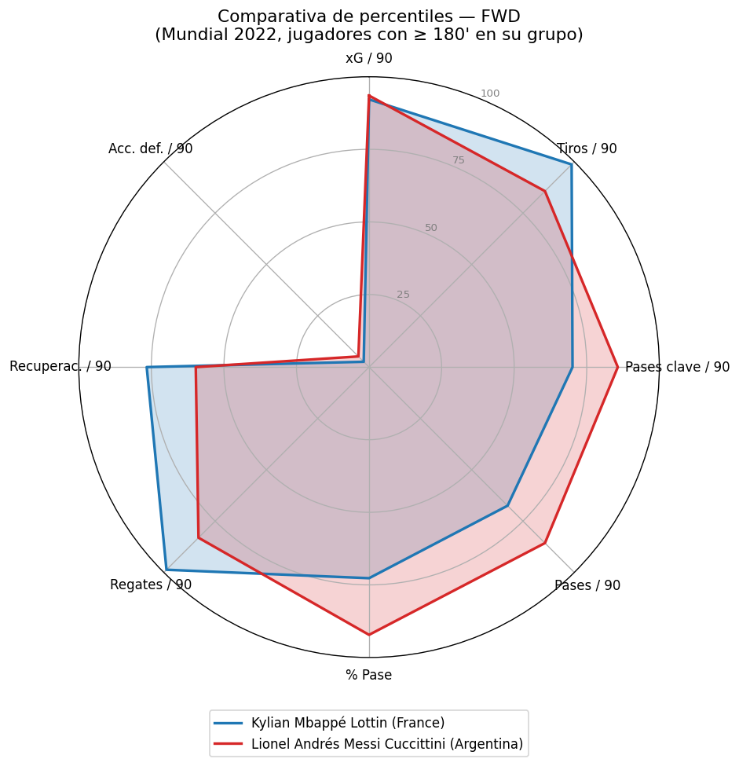
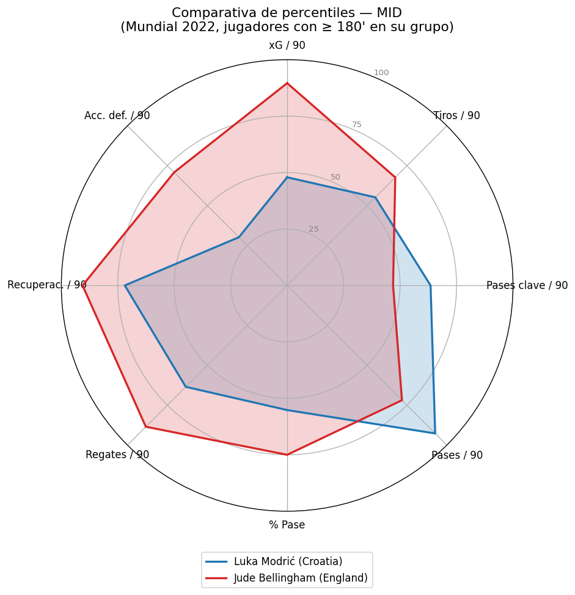
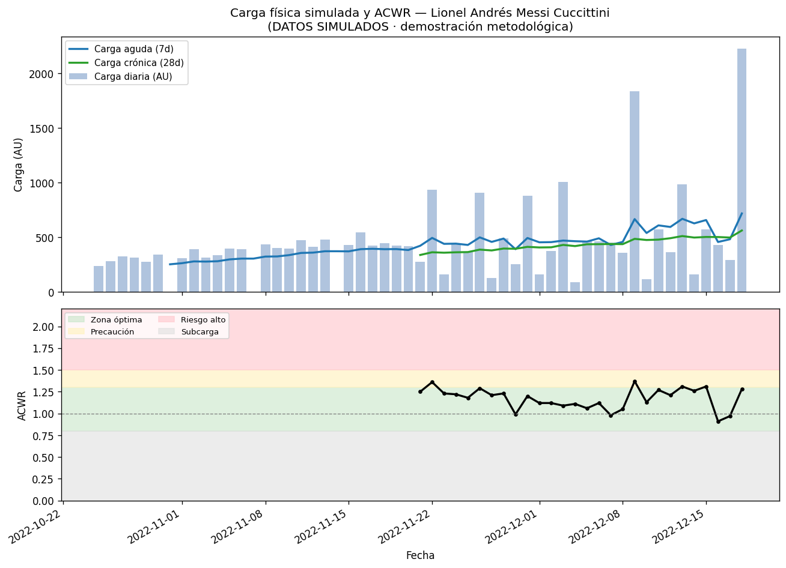

# ⚽ Fútbol Analytics

Pipeline de datos y analítica de fútbol profesional construido sobre los datos
abiertos de **StatsBomb** (Copa del Mundo 2022). El proyecto cubre el flujo
completo de un equipo de datos / BI en un club: extracción de datos crudos,
modelado en una base relacional, cálculo de KPIs, un modelo de **goles esperados
(xG)** propio, scouting por percentiles y un módulo de carga física (ACWR).

> Proyecto de portfolio orientado a roles de **Analista de Datos / BI** en el
> ámbito deportivo. Todo el código es reproducible end-to-end con un solo comando.


**Dataset procesado (Mundial 2022):** 64 partidos · 234.637 eventos · 1.494 tiros
· 829 jugadores · 32 equipos. El pipeline completo corre en **~35 segundos** con
los datos cacheados.

---

## 🎯 Objetivos

- Construir un **ETL reproducible** desde una fuente real y pública (StatsBomb Open Data).
- Modelar los datos en **SQLite** con un esquema relacional limpio.
- Calcular **KPIs** de equipo y jugador y exportarlos listos para **Power BI / Looker Studio**.
- Entrenar un **modelo de xG** y validarlo contra el xG oficial de StatsBomb.
- Generar **informes de scouting** (percentiles por posición + radares).
- Demostrar metodología de **carga física (ACWR)** y alertas de riesgo de lesión.

---

## 🧱 Stack técnico

| Área | Herramientas |
|------|--------------|
| Lenguaje | Python 3.10+ |
| Datos | pandas, numpy |
| Machine Learning | scikit-learn |
| Visualización | matplotlib |
| Descarga | requests |
| Base de datos | SQLite (`sqlite3` / SQLAlchemy) |
| Exportaciones BI | CSV y Excel (`openpyxl`) |

**Fuente de datos:** [StatsBomb Open Data](https://github.com/statsbomb/open-data) —
Copa del Mundo 2022 (`competition_id=43`, `season_id=106`, 64 partidos).

---

## 🚀 Instalación y uso

```bash
# 1. Crear y activar entorno virtual
python -m venv venv
# Windows
venv\Scripts\activate
# Linux / macOS
source venv/bin/activate

# 2. Instalar dependencias
pip install -r requirements.txt

# 3. Ejecutar el pipeline completo (idempotente; usa la caché de datos)
python run_pipeline.py

# Forzar la re-descarga de los datos de StatsBomb:
python run_pipeline.py --force
```

> La primera ejecución descarga los 128 archivos JSON de StatsBomb (eventos +
> alineaciones de 64 partidos) y los cachea en `data/raw/`. Las siguientes
> ejecuciones reutilizan esa caché.

---

## 🧩 Arquitectura del pipeline

El flujo es un pipeline lineal e idempotente orquestado por `run_pipeline.py`:

```
StatsBomb Open Data (JSON)
        │  extract.py  (descarga + caché en data/raw/)
        ▼
   transform.py  (aplana eventos → tablas; geometría y freeze frame de tiros)
        │
        ▼
   load.py + schema.sql  →  SQLite (outputs/futbol.db)
        │
        ├──► kpis.py       → KPIs equipo/jugador  → CSV + Excel (Power BI)
        ├──► xg_model.py   → modelo de xG          → joblib + CSV
        ├──► scouting.py   → percentiles + radares → CSV + PNG
        └──► acwr.py       → carga simulada + ACWR → CSV + PNG
```

Cada módulo es ejecutable por separado (`python -m src.<paquete>.<modulo>`) o todo
junto con `python run_pipeline.py`.

### Módulos

- [x] **Módulo 1** — Scaffolding + Git
- [x] **Módulo 2** — ETL multifuente (StatsBomb → SQLite)
- [x] **Módulo 3** — KPIs y dashboards
- [x] **Módulo 4** — Modelo de goles esperados (xG)
- [x] **Módulo 5** — Scouting (percentiles + radares)
- [x] **Módulo 6** — Carga física y ACWR
- [x] **Módulo 7** — Orquestación + README final

---

## 📊 Conectar Power BI / Looker Studio

Tras ejecutar el pipeline, en `outputs/exports/` quedan los datasets listos para BI:

| Archivo | Contenido |
|---------|-----------|
| `kpis_equipos.csv` | KPIs por equipo (goles, tiros, xG, % pase, posesión proxy) |
| `kpis_jugadores.csv` | KPIs por jugador (minutos, goles, asistencias, xG, xG/90) |
| `tiros.csv` | Tabla de tiros con todas las features |
| `kpis_futbol.xlsx` | Las tres tablas en un único Excel multi-hoja |

**Power BI Desktop:**
1. *Obtener datos → Texto/CSV* (o *Excel*) y elegir el archivo de `outputs/exports/`.
2. *Cargar* cada tabla. Para el Excel, seleccionar las hojas `kpis_equipos`,
   `kpis_jugadores` y `tiros` en el Navegador.
3. En la vista *Modelo*, relacionar `tiros[team_name]` con `kpis_equipos[team_name]`
   y `tiros[player_name]` con `kpis_jugadores[player_name]` si se quieren cruzar.
4. Construir visuales (ranking de goleadores, xG vs goles, mapa de tiros con
   `location_x` / `location_y`, etc.).

**Looker Studio:** *Crear → Fuente de datos → Subida de archivos (CSV)* y subir
los `.csv`. Los archivos usan codificación `utf-8-sig` para que los acentos se
vean correctamente.

> Los exports se versionan en el repositorio, así que el dashboard puede
> reproducirse sin necesidad de re-ejecutar todo el pipeline.

---

## 🤖 Modelo de goles esperados (xG)

Se entrena un modelo propio de xG sobre los **1.430 tiros en juego** del Mundial
(excluyendo penales) y se compara contra el xG oficial de StatsBomb.

**Features:** distancia y ángulo al arco, distancia a la línea de gol, descentrado
lateral, parte del cuerpo (cabeza), tipo de jugada (tiro libre / córner), presión,
remate de primera, y features del *freeze frame* (defensores en el cono de tiro,
distancia del arquero, nº de rivales y compañeros).

**Evaluación** (validación cruzada estratificada, 5 folds — valores reales):

| Modelo | ROC-AUC | Correlación de Pearson con StatsBomb xG |
|--------|:-------:|:---------------------------------------:|
| **LogisticRegression** (elegido) | **0.802** | **0.885** |
| GradientBoosting | 0.759 | 0.739 |

> El modelo logístico, además de ser el más interpretable, obtuvo el mejor
> ROC-AUC. La **correlación de 0.885** con el xG oficial de StatsBomb indica que
> reproduce muy de cerca un modelo profesional usando solo features públicas.

**Decisión sobre penales:** se modelan **aparte** con un valor fijo de
`xG = 0.79` (probabilidad de conversión histórica de un penal), ya que su
resultado no depende de la geometría del tiro. Los **penales de tanda**
(`period = 5`) se excluyen por completo: no son tiros en juego.

**Salidas:** `outputs/exports/xg_model.joblib` (modelo entrenado) y
`outputs/exports/xg_predicciones.csv` (xG predicho por tiro vs StatsBomb).

---

## 🔍 Scouting (percentiles por posición + radares)

Se calculan métricas **por 90 minutos** para cada jugador y se obtienen
**percentiles dentro de su grupo posicional** (GK / DEF / MID / FWD), sobre un
pool de **345 jugadores** con al menos 180 minutos. La función
`compare_players(player_a, player_b)` genera un radar comparativo entre dos
jugadores de la misma posición.

Métricas del radar: xG/90, tiros/90, pases clave/90, pases/90, % de pase
completado, regates/90, recuperaciones/90 y acciones defensivas/90.

| Mbappé vs Messi (FWD) | Modrić vs Bellingham (MID) |
|:---:|:---:|
|  |  |

**Salida:** `outputs/exports/scouting_percentiles.csv` y los radares en
`outputs/figures/`.

---

## 🏃 Carga física y ACWR — ⚠️ módulo metodológico (datos simulados)

> **StatsBomb Open Data NO incluye datos de GPS / carga física.** Por eso este
> módulo **genera datos de carga simulados** de forma realista (a partir de los
> minutos jugados, la intensidad del partido y sesiones de entrenamiento
> sintéticas, con una rampa de pretemporada). **No son datos reales:** el objetivo
> es demostrar la **metodología** de monitoreo de carga que se aplicaría en un
> club con datos reales de GPS.

Se calcula el **ACWR** (Acute:Chronic Workload Ratio):

```
ACWR = carga aguda (media móvil 7 días) / carga crónica (media móvil 28 días)
```

Y se clasifica en zonas de riesgo, generando alertas de riesgo de lesión:

| Zona | Rango ACWR | Interpretación |
|------|:----------:|----------------|
| Subcarga | `< 0.8` | Estímulo insuficiente |
| **Óptima** | `0.8 – 1.3` | *Sweet spot* |
| Precaución | `1.3 – 1.5` | Carga elevándose |
| **Riesgo alto** | `> 1.5` | Riesgo de lesión |

**Salidas:** `outputs/exports/acwr_serie.csv` (serie diaria con ACWR y zona),
`outputs/exports/acwr_alertas.csv` (días en zona de riesgo) y un gráfico de
ejemplo en `outputs/figures/`:



---

## 📁 Estructura del repositorio

```
futbol-analytics/
├── config.py                 # rutas, IDs de competición, constantes StatsBomb
├── run_pipeline.py           # orquesta ETL → DB → KPIs → modelo → scouting → físico
├── requirements.txt
├── data/                     # (ignorado por git)
│   ├── raw/                  # JSON descargados de StatsBomb (caché)
│   └── processed/            # intermedios
├── src/
│   ├── etl/
│   │   ├── extract.py        # descarga matches/events/lineups con caché y reintentos
│   │   ├── transform.py      # aplana JSON → tablas; geometría + freeze frame de tiros
│   │   └── load.py           # carga a SQLite + resumen
│   ├── db/
│   │   └── schema.sql        # DDL (tablas, claves, índices)
│   ├── kpis/
│   │   └── kpis.py           # KPIs equipo/jugador (vistas SQL) + exports BI
│   ├── models/
│   │   └── xg_model.py       # modelo de xG (LogReg vs GradientBoosting)
│   ├── scouting/
│   │   └── scouting.py       # percentiles por posición + radares
│   └── physical/
│       └── acwr.py           # carga simulada + ACWR + alertas
├── outputs/
│   ├── futbol.db             # base SQLite (ignorada por git)
│   ├── exports/              # CSV/Excel para BI  (versionados ✔)
│   └── figures/              # radares y gráficos (versionados ✔)
└── notebooks/                # exploración (opcional)
```

---

## 🗃️ Esquema de la base de datos

| Tabla | Filas | Descripción |
|-------|------:|-------------|
| `matches` | 64 | Un registro por partido |
| `teams` | 32 | Equipos participantes |
| `players` | 829 | Jugadores |
| `lineups` | 3.244 | Participación por partido (minutos, titularidad) |
| `events` | 234.637 | Eventos (tipo, equipo, jugador, x/y, presión, flags de pase) |
| `shots` | 1.494 | Tabla derivada con todas las features de tiro y `statsbomb_xg` |

---

## ✍️ Convenciones

- Código y *docstrings* en **inglés**; comentarios y documentación en **español**.
- *Conventional Commits* (`feat`, `chore`, `docs`, …) por módulo.
- Datos crudos y base de datos **fuera de git** (`.gitignore`); los exports y
  figuras pequeñas **sí se versionan** para que el repo se vea completo.
